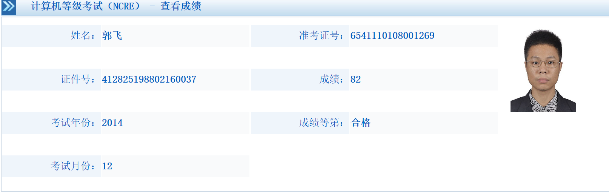
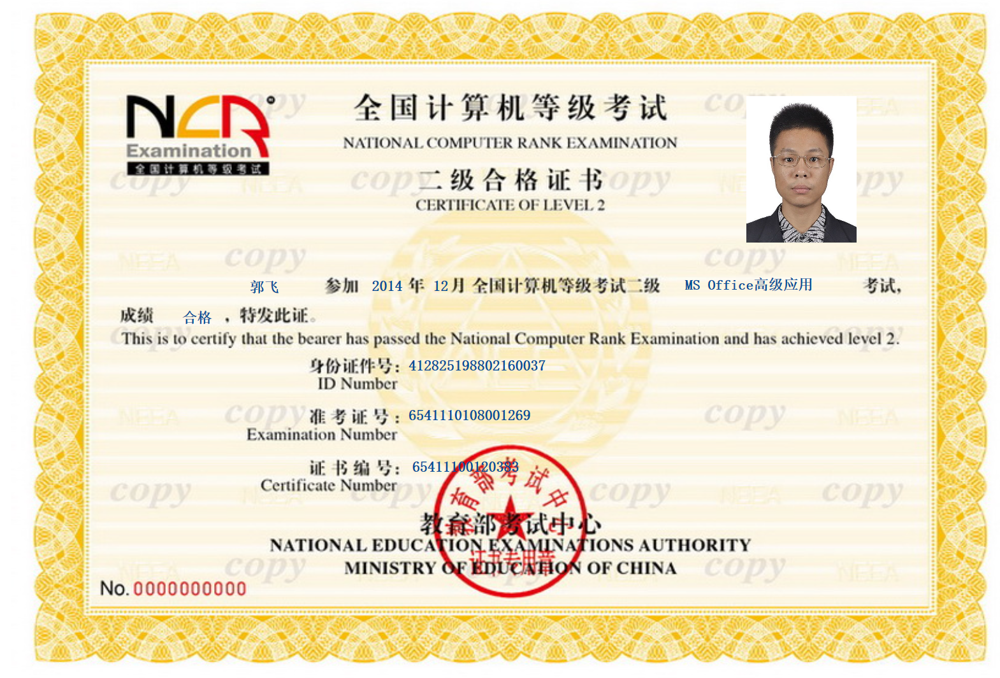


# past
## 考证
- 工信部数据分析师（高级）
http://www.gcvaic.org:8080/SubPage/ZSCX_Zyjscx.aspx
160050940300397

- 职称计算机
http://www.bjrbj.gov.cn/kwscore/login/notsign.htm
201412期

- 职称外语
http://zg.cpta.com.cn/examfront/bscore!initializeCX.action
2015年3月

- 中级经济师
http://zg.cpta.com.cn/examfront/bscore!initializeCX.action

2015年11月

- 计算机二级
http://chaxun.neea.edu.cn/examcenter/query.cn?op=doQueryResults&pram=certi
准考证号：6541110108001269
时间：2014年12月

- 会计从业
- 证券从业
- 期货从业

## 学术能力
- SPG审稿员
http://www.sciencepublishinggroup.com/
- >账户 guofei9987@foxmail.com
密码 w
点击 Application Result

- SPG的那篇文章
http://article.sciencepublishinggroup.com/html/10.11648.j.jfa.20150306.12.html#paper-keywords
[附件](past/SciencePG.7z)

- 中外企业家那篇
http://www.cnki.net/KCMS/detail/detail.aspx?QueryID=6&CurRec=1&recid=&filename=ZWQY201430051&dbname=CJFDLAST2015&dbcode=CJFQ&pr=&urlid=&yx=&uid=WEEvREcwSlJHSldSdnQ1YWloVytWUUFXNXMwSnYzeDdLUFNXMnU1ZXlJa1pqTW5la093SEwwTlNFV0dNeXFQRE13PT0=$9A4hF_YAuvQ5obgVAq
